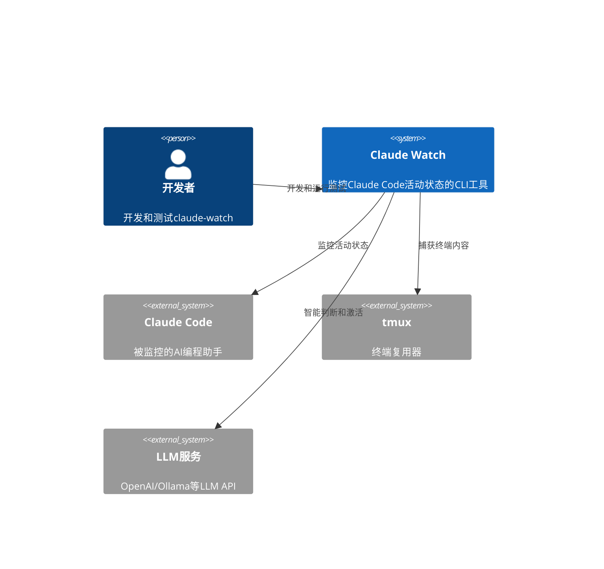

# Claude Watch 测试系统架构设计

## 执行概要

claude-watch是一个Rust CLI应用，用于监控Claude Code的活动状态。测试系统采用分层架构，重点关注核心业务逻辑的测试覆盖，同时处理外部依赖的Mock和集成测试。

## 系统上下文



## 测试架构分层

### 1. 单元测试层 (Unit Tests)
**目标**: 测试核心业务逻辑函数，无外部依赖

**测试范围**:
- `activity.rs` - 活动检测逻辑
- `monitor.rs` - 监控核心算法
- `config.rs` - 配置解析和验证
- `llm.rs` - LLM调用逻辑（Mock版本）

**测试策略**:
```rust
// 单元测试示例
#[cfg(test)]
mod tests {
    use super::*;
    
    #[test]
    fn test_activity_detection_standard_format() {
        // 测试标准格式检测
        assert!(is_claude_active("* Herding… (343s · ↑ 14.2k tokens · esc to interrupt)"));
    }
    
    #[test]
    fn test_time_extraction() {
        // 测试时间提取逻辑
        assert_eq!(extract_execution_time("* Herding… (343s · ↑ 14.2k tokens)"), Some(343));
    }
}
```

### 2. 集成测试层 (Integration Tests)
**目标**: 测试模块间的交互，使用Mock外部依赖

**测试范围**:
- 监控循环逻辑
- 配置加载和验证
- 状态机转换
- 错误处理流程

**Mock策略**:
```rust
// Mock tmux模块
pub struct MockTmux {
    pub responses: Vec<String>,
    pub calls: Vec<String>,
}

impl MockTmux {
    pub fn capture(&mut self, _pane: &str) -> String {
        self.responses.pop().unwrap_or_default()
    }
    
    pub fn send_keys(&mut self, keys: &str, _pane: &str) {
        self.calls.push(keys.to_string());
    }
}

// Mock LLM服务
pub struct MockLlmService {
    pub responses: Vec<TaskStatus>,
}

impl MockLlmService {
    pub async fn ask_final_status(&self, _text: &str) -> Result<TaskStatus, String> {
        Ok(self.responses.first().cloned().unwrap_or(TaskStatus::Done))
    }
}
```

### 3. 端到端测试层 (E2E Tests)
**目标**: 测试完整的工作流程，使用真实环境或容器化测试

**测试范围**:
- 完整监控循环
- 真实tmux会话
- 卡住检测和恢复
- 配置文件加载

**测试环境**:
```rust
// E2E测试设置
pub struct TestEnvironment {
    pub tmux_session: String,
    pub test_pane: String,
    pub config_file: String,
}

impl TestEnvironment {
    pub async fn setup() -> Self {
        // 创建tmux会话
        // 启动Claude Code模拟器
        // 创建测试配置
        TestEnvironment {
            tmux_session: "claude-test".to_string(),
            test_pane: "%0".to_string(),
            config_file: "/tmp/test_config.yaml".to_string(),
        }
    }
    
    pub async fn teardown(self) {
        // 清理tmux会话
        // 删除临时文件
    }
}
```

## 核心测试模块设计

### Activity Detection 测试
```rust
// tests/activity_detection.rs (已存在)
mod activity_detection_tests {
    use super::*;
    
    // 测试用例分类
    // 1. 标准格式检测
    // 2. 简单时间格式检测
    // 3. 工具调用检测
    // 4. 多行文本检测
    // 5. 边界情况检测
    // 6. 真实场景检测
}
```

### Monitor Logic 测试
```rust
// tests/monitor_logic.rs
mod monitor_tests {
    use super::*;
    
    #[test]
    fn test_time_extraction() {
        // 测试时间提取功能
    }
    
    #[test]
    fn test_time_increasing_detection() {
        // 测试时间递增检测
    }
    
    #[test]
    fn test_substantial_progress_detection() {
        // 测试实质性进展检测
    }
    
    #[test]
    fn test_llm_call_skip_logic() {
        // 测试LLM调用跳过逻辑
    }
}
```

### Configuration 测试
```rust
// tests/config_tests.rs
mod config_tests {
    use super::*;
    
    #[test]
    fn test_config_parsing() {
        // 测试配置文件解析
    }
    
    #[test]
    fn test_config_validation() {
        // 测试配置验证
    }
    
    #[test]
    fn test_default_values() {
        // 测试默认值设置
    }
}
```

## Mock 和 Stub 策略

### 外部依赖处理
```rust
// src/testing/mod.rs
pub mod mocks {
    // Mock tmux operations
    pub struct MockTmuxClient {
        pub captured_content: String,
        pub sent_commands: Vec<String>,
    }
    
    impl MockTmuxClient {
        pub fn new() -> Self {
            Self {
                captured_content: String::new(),
                sent_commands: Vec::new(),
            }
        }
        
        pub fn set_response(&mut self, content: &str) {
            self.captured_content = content.to_string();
        }
    }
    
    // Mock LLM service
    pub struct MockLlmClient {
        pub responses: Vec<TaskStatus>,
        pub should_fail: bool,
    }
    
    impl MockLlmClient {
        pub fn new() -> Self {
            Self {
                responses: vec![TaskStatus::Done],
                should_fail: false,
            }
        }
        
        pub fn set_response(&mut self, status: TaskStatus) {
            self.responses = vec![status];
        }
        
        pub fn set_failure(&mut self) {
            self.should_fail = true;
        }
    }
}
```

### 测试数据管理
```rust
// src/testing/test_data.rs
pub mod test_data {
    // 真实场景测试数据
    pub const REAL_WORLD_SCENARIOS: &[(&str, bool)] = &[
        // 正在工作
        ("* Herding… (169s · ↑ 8.7k tokens · esc to interrupt)", true),
        ("Tool use: Reading file\n* Cogitating… (234s · ↓ 11.2k tokens)", true),
        
        // 已完成
        ("Task completed\nAll done", false),
        ("✅ 任务完成", false),
        
        // 卡住状态
        ("Interrupted by user\n>", false),
        ("Error: Something went wrong", false),
    ];
    
    // 边界情况测试数据
    pub const EDGE_CASES: &[(&str, bool)] = &[
        ("", false),
        ("   ", false),
        ("* Herding… (not-a-number s · tokens)", false),
        ("(343s) but no tokens", true),
    ];
}
```

## 性能测试架构

### 基准测试
```rust
// benches/monitor_bench.rs
use criterion::{criterion_group, criterion_main, Criterion};

fn bench_activity_detection(c: &mut Criterion) {
    let test_cases = vec![
        "* Herding… (343s · ↑ 14.2k tokens · esc to interrupt)",
        "Tool use: Reading file",
        "Simple text without activity",
    ];
    
    c.bench_function("activity_detection", |b| {
        b.iter(|| {
            for case in &test_cases {
                is_claude_active(case);
            }
        })
    });
}

fn bench_time_extraction(c: &mut Criterion) {
    let test_cases = vec![
        "* Herding… (343s · ↑ 14.2k tokens)",
        "56s · ↓ 2.3k tokens",
        "No time here",
    ];
    
    c.bench_function("time_extraction", |b| {
        b.iter(|| {
            for case in &test_cases {
                extract_execution_time(case);
            }
        })
    });
}

criterion_group!(benches, bench_activity_detection, bench_time_extraction);
criterion_main!(benches);
```

### 内存使用测试
```rust
// tests/memory_usage.rs
#[test]
fn test_memory_usage_monitoring() {
    // 测试长时间运行的内存使用
    let mut monitor = Monitor::new(test_config());
    
    for _ in 0..1000 {
        monitor.check_status();
        // 检查内存使用是否在合理范围内
        assert_memory_usage_below(10_000_000); // 10MB
    }
}
```

## 测试覆盖率策略

### 覆盖率目标
- **单元测试**: 90%+ 核心逻辑覆盖率
- **集成测试**: 80%+ 主要流程覆盖率
- **E2E测试**: 关键用户场景全覆盖

### 覆盖率工具配置
```toml
# Cargo.toml
[dev-dependencies]
cargo-llvm-cov = "0.5"
tarpaulin = "0.25"
criterion = "0.5"
```

### CI/CD 集成
```yaml
# .github/workflows/test.yml
name: Tests
on: [push, pull_request]
jobs:
  test:
    runs-on: ubuntu-latest
    steps:
      - uses: actions/checkout@v3
      - uses: actions-rs/toolchain@v1
      - name: Run tests
        run: |
          cargo test --all-features
          cargo llvm-cov --lcov --output-path coverage-report.lcov
      - name: Upload coverage
        uses: codecov/codecov-action@v3
```

## 测试数据捕获和管理

### 真实场景数据捕获
```rust
// src/testing/capture.rs
pub struct TestDataCapture {
    pub scenarios: Vec<TestScenario>,
}

impl TestDataCapture {
    pub fn capture_real_scenario(
        name: &str,
        pane: &str,
        duration: Duration,
    ) -> TestScenario {
        // 捕获真实场景数据
        let mut captures = Vec::new();
        let start = Instant::now();
        
        while start.elapsed() < duration {
            let content = capture(pane);
            captures.push(content);
            thread::sleep(Duration::from_secs(1));
        }
        
        TestScenario {
            name: name.to_string(),
            captures,
            expected_behavior: ExpectedBehavior::from_captures(&captures),
        }
    }
}
```

### 测试数据存储
```yaml
# test_data/real_scenarios.yaml
scenarios:
  - name: "normal_working"
    description: "Claude Code正常工作状态"
    captures:
      - "* Herding… (343s · ↑ 14.2k tokens · esc to interrupt)"
      - "* Cogitating… (344s · ↑ 14.3k tokens · esc to interrupt)"
    expected_behavior:
      is_active: true
      time_increasing: true
      should_skip_llm: true
  
  - name: "stuck_state"
    description: "Claude Code卡住状态"
    captures:
      - "Interrupted by user\n>"
      - "Interrupted by user\n>"
    expected_behavior:
      is_active: false
      time_increasing: false
      should_skip_llm: false
```

## 质量门禁

### 测试质量检查
```rust
// tests/quality_checks.rs
#[test]
fn test_all_test_cases_have_assertions() {
    // 确保所有测试用例都有断言
    let test_files = vec![
        "tests/activity_detection.rs",
        "tests/monitor_logic.rs",
        "tests/config_tests.rs",
    ];
    
    for file in test_files {
        ensure_test_has_assertions(file);
    }
}

#[test]
fn test_error_scenarios_covered() {
    // 确保错误场景被覆盖
    let error_scenarios = vec![
        "tmux_capture_failure",
        "llm_api_failure",
        "config_parse_error",
        "network_timeout",
    ];
    
    for scenario in error_scenarios {
        assert!(error_scenario_tested(scenario));
    }
}
```

### 性能基线检查
```rust
// tests/performance_baseline.rs
#[test]
fn test_performance_baseline() {
    let baseline = PerformanceBaseline::load();
    let current = measure_current_performance();
    
    assert!(current.activity_detection_time <= baseline.activity_detection_time * 1.2);
    assert!(current.memory_usage <= baseline.memory_usage * 1.1);
}
```

## 总结

claude-watch的测试系统架构采用分层设计，重点关注：

1. **核心逻辑测试**: 确保活动检测、监控算法等核心功能正确
2. **Mock策略**: 通过Mock处理外部依赖，提高测试可靠性
3. **真实场景**: 捕获和测试真实使用场景的数据
4. **性能监控**: 确保系统性能满足监控需求
5. **质量门禁**: 通过覆盖率、性能基线等确保测试质量

这个架构既保证了测试的全面性，又避免了过度设计，适合claude-watch这样的小型CLI工具项目。