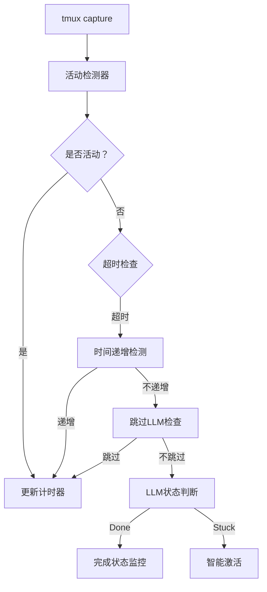

# Claude Code 新状态标识适配架构设计

## 1. 系统架构设计

### 1.1 当前状态检测架构



### 1.2 新格式适配策略

#### 1.2.1 已识别的Claude Code状态格式

**当前支持的状态标识符**：
- `✽ Philosophising…` - 深度思考状态
- `* Philosophising…` - 深度思考状态
- `* Combobulating…` - 组合处理状态
- `* Herding…` - 思考状态
- `* Cogitating…` - 思考状态
- `* Meandering…` - 思考状态
- `* Reticulating…` - 思考状态
- `* Thinking…` - 思考状态

**标准执行条格式**：
```
✽ Philosophising… (352s · ↓ 7 tokens · esc to interrupt)
* Philosophising… (359s · ↓ 7 tokens · esc to interrupt)
* Combobulating… (123s · ↑ 8.7k tokens · esc to interrupt)
```

#### 1.2.2 适配策略矩阵

| 状态类型 | 识别策略 | 优先级 | 处理方式 |
|---------|---------|--------|----------|
| 标准执行条 | 正则表达式匹配 | 最高 | 跳过LLM调用 |
| 简单状态词 | 关键词匹配 | 高 | 活动检测 |
| 命令提示符 | 特殊字符匹配 | 中 | 空闲状态 |
| 错误状态 | 错误关键词匹配 | 中 | 卡住状态 |
| 完成状态 | 完成关键词匹配 | 中 | 完成监控 |

### 1.3 向后兼容性设计

#### 1.3.1 渐进式适配原则

1. **保持现有接口不变**
   - `is_claude_active()` 函数签名不变
   - `extract_execution_time()` 函数签名不变
   - `check_if_should_skip_llm_call()` 函数签名不变

2. **扩展检测能力**
   - 新增状态检测函数作为内部实现
   - 通过配置控制是否启用新格式检测
   - 提供格式兼容性测试

3. **版本化配置**
   ```rust
   pub struct DetectionConfig {
       pub legacy_format: bool,    // 启用旧格式检测
       pub new_format: bool,       // 启用新格式检测
       pub strict_mode: bool,      // 严格模式（只识别已知格式）
       pub experimental: bool,     // 实验性格式检测
   }
   ```

### 1.4 模块化改进方案

#### 1.4.1 状态检测器模块化

```rust
// src/detectors/mod.rs
pub mod state_detector;
pub mod execution_bar_detector;
pub mod time_detector;
pub mod content_change_detector;

// 统一检测器接口
pub trait Detector {
    fn detect(&self, text: &str) -> DetectionResult;
    fn confidence(&self) -> f64;
    fn is_compatible(&self, format_version: &str) -> bool;
}
```

#### 1.4.2 检测器注册机制

```rust
// 检测器注册表
pub struct DetectorRegistry {
    detectors: Vec<Box<dyn Detector>>,
    config: DetectionConfig,
}

impl DetectorRegistry {
    pub fn register_detector(&mut self, detector: Box<dyn Detector>);
    pub fn detect_all(&self, text: &str) -> Vec<DetectionResult>;
    pub fn get_best_match(&self, text: &str) -> Option<DetectionResult>;
}
```

## 2. 技术实现方案

### 2.1 正则表达式优化设计

#### 2.1.1 预编译正则表达式池

```rust
// src/regex_pool.rs
pub struct RegexPool {
    // 状态标识符模式
    state_patterns: Vec<Regex>,
    // 执行条格式模式
    execution_bar_patterns: Vec<Regex>,
    // 时间提取模式
    time_patterns: Vec<Regex>,
    // 错误状态模式
    error_patterns: Vec<Regex>,
}

impl RegexPool {
    pub fn new() -> Self {
        Self {
            // 支持多种状态标识符
            state_patterns: vec![
                // 标准状态格式
                Regex::new(r"[\*✽✢·✻✽]\s*([A-Za-z]+)…\s*\(").unwrap(),
                // 简单状态格式
                Regex::new(r"\b([A-Za-z]+)ing\b").unwrap(),
                // 完成状态
                Regex::new(r"\b(Done|Completed|Finished)\b").unwrap(),
            ],
            
            // 执行条格式 - 支持多种变体
            execution_bar_patterns: vec![
                // 完整执行条格式
                Regex::new(r"[\*✽✢·✻✽][^)]*\([^)]*\d+s[^)]*tokens[^)]*esc to interrupt\)").unwrap(),
                // 简化执行条格式
                Regex::new(r"[\*✽✢·✻✽][^)]*\([^)]*\d+s[^)]*\)").unwrap(),
            ],
            
            // 时间提取模式
            time_patterns: vec![
                // 标准时间格式
                Regex::new(r"\((\d+)s[^)]*\)").unwrap(),
                // 简化时间格式
                Regex::new(r"\b(\d+)s\b").unwrap(),
            ],
            
            // 错误状态模式
            error_patterns: vec![
                Regex::new(r"\b(Error|Failed|error:|Error:)\b").unwrap(),
                Regex::new(r"\b(Interrupted|Aborted|Cancelled)\s+by\s+user\b").unwrap(),
            ],
        }
    }
}
```

#### 2.1.2 动态正则表达式构建

```rust
// 支持运行时添加新的格式模式
pub fn add_pattern(&mut self, pattern_type: PatternType, pattern: &str) -> Result<(), RegexError> {
    let regex = Regex::new(pattern)?;
    match pattern_type {
        PatternType::State => self.state_patterns.push(regex),
        PatternType::ExecutionBar => self.execution_bar_patterns.push(regex),
        PatternType::Time => self.time_patterns.push(regex),
        PatternType::Error => self.error_patterns.push(regex),
    }
    Ok(())
}
```

### 2.2 状态检测逻辑改进

#### 2.2.1 分层检测策略

```rust
// src/detection/hierarchical.rs
pub struct HierarchicalDetector {
    regex_pool: RegexPool,
    config: DetectionConfig,
}

impl HierarchicalDetector {
    pub fn detect_activity(&self, text: &str) -> ActivityDetection {
        // 第一层：快速检测（高性能）
        if let Some(result) = self.fast_detection(text) {
            return result;
        }
        
        // 第二层：标准检测（平衡性能和准确性）
        if let Some(result) = self.standard_detection(text) {
            return result;
        }
        
        // 第三层：深度检测（高准确性）
        self.deep_detection(text)
    }
    
    fn fast_detection(&self, text: &str) -> Option<ActivityDetection> {
        // 快速检查明显的活动状态
        for pattern in &self.regex_pool.execution_bar_patterns {
            if pattern.is_match(text) {
                return Some(ActivityDetection::Active);
            }
        }
        None
    }
    
    fn standard_detection(&self, text: &str) -> Option<ActivityDetection> {
        // 标准检测逻辑
        let lines: Vec<&str> = text.lines().collect();
        
        // 检查最后几行
        for line in lines.iter().rev().take(10) {
            if self.is_activity_line(line) {
                return Some(ActivityDetection::Active);
            }
        }
        
        None
    }
    
    fn deep_detection(&self, text: &str) -> ActivityDetection {
        // 深度检测：完整的内容分析
        let has_state_keywords = self.has_state_keywords(text);
        let has_time_progression = self.has_time_progression(text);
        let has_content_changes = self.has_content_changes(text);
        
        match (has_state_keywords, has_time_progression, has_content_changes) {
            (true, true, _) => ActivityDetection::Active,
            (true, false, true) => ActivityDetection::Active,
            (false, true, true) => ActivityDetection::Active,
            _ => ActivityDetection::Inactive,
        }
    }
}
```

#### 2.2.2 状态关键词检测

```rust
impl HierarchicalDetector {
    fn has_state_keywords(&self, text: &str) -> bool {
        let state_keywords = [
            // 核心思考状态
            "Philosophising", "Cogitating", "Herding", "Meandering", 
            "Reticulating", "Thinking", "Contemplating", "Combobulating",
            // 处理状态
            "Processing", "Compiling", "Building", "Executing",
            // 工具状态
            "Reading", "Writing", "Generating", "Creating", "Analyzing",
            "Calling", "Searching", "Browsing", "Loading", "Saving",
        ];
        
        for keyword in &state_keywords {
            if text.contains(keyword) {
                return true;
            }
        }
        false
    }
}
```

### 2.3 时间提取逻辑优化

#### 2.3.1 多格式时间提取

```rust
// src/detection/time_extractor.rs
pub struct TimeExtractor {
    patterns: Vec<Regex>,
}

impl TimeExtractor {
    pub fn extract_time(&self, text: &str) -> Option<TimeInfo> {
        // 尝试多种时间格式
        for pattern in &self.patterns {
            if let Some(caps) = pattern.captures(text) {
                if let Some(time_str) = caps.get(1) {
                    if let Ok(time) = time_str.as_str().parse::<u64>() {
                        return Some(TimeInfo {
                            seconds: time,
                            confidence: self.calculate_confidence(&caps),
                            format: self.detect_format(&caps),
                        });
                    }
                }
            }
        }
        None
    }
    
    fn calculate_confidence(&self, caps: &regex::Captures) -> f64 {
        // 基于匹配质量计算置信度
        let mut confidence = 0.5;
        
        // 完整执行条格式置信度高
        if caps.get(0).unwrap().as_str().contains("tokens") {
            confidence += 0.3;
        }
        
        // 有状态关键词置信度高
        if caps.get(0).unwrap().as_str().contains("Philosophising") {
            confidence += 0.2;
        }
        
        confidence.min(1.0)
    }
}
```

#### 2.3.2 时间递增检测优化

```rust
// src/detection/time_tracker.rs
pub struct TimeTracker {
    // 为每个pane跟踪时间状态
    pane_states: HashMap<String, PaneTimeState>,
}

pub struct PaneTimeState {
    last_time: Option<u64>,
    last_update: Instant,
    time_increments: usize,
    stuck_threshold: usize,
}

impl TimeTracker {
    pub fn is_time_increasing(&mut self, text: &str, pane: &str) -> bool {
        if let Some(current_time) = self.extract_time(text) {
            let state = self.pane_states.entry(pane.to_string())
                .or_insert_with(|| PaneTimeState::new());
            
            state.update(current_time)
        } else {
            false
        }
    }
}

impl PaneTimeState {
    pub fn update(&mut self, current_time: u64) -> bool {
        match self.last_time {
            Some(last) => {
                if current_time > last {
                    self.last_time = Some(current_time);
                    self.last_update = Instant::now();
                    self.time_increments += 1;
                    true
                } else if current_time == last {
                    // 时间相同，检查是否超时
                    self.last_update.elapsed() > Duration::from_secs(30)
                } else {
                    // 时间倒流，可能是错误状态
                    false
                }
            }
            None => {
                self.last_time = Some(current_time);
                self.last_update = Instant::now();
                true // 第一次看到时间，认为是活动的
            }
        }
    }
}
```

### 2.4 错误处理机制

#### 2.4.1 分级错误处理

```rust
// src/error/handling.rs
#[derive(Debug)]
pub enum DetectionError {
    // 轻微错误：继续使用备用方法
    RegexError(regex::Error),
    PatternNotMatched,
    
    // 中等错误：记录日志但继续
    TimeExtractionFailed,
    StateDetectionFailed,
    
    // 严重错误：需要用户干预
    ConfigurationError,
    DataCorruptionError,
}

impl DetectionError {
    pub fn severity(&self) -> ErrorSeverity {
        match self {
            DetectionError::RegexError(_) => ErrorSeverity::Low,
            DetectionError::PatternNotMatched => ErrorSeverity::Low,
            DetectionError::TimeExtractionFailed => ErrorSeverity::Medium,
            DetectionError::StateDetectionFailed => ErrorSeverity::Medium,
            DetectionError::ConfigurationError => ErrorSeverity::High,
            DetectionError::DataCorruptionError => ErrorSeverity::High,
        }
    }
    
    pub fn should_continue(&self) -> bool {
        self.severity() != ErrorSeverity::High
    }
}
```

#### 2.4.2 错误恢复策略

```rust
// src/error/recovery.rs
pub struct ErrorRecovery {
    fallback_strategies: Vec<Box<dyn FallbackStrategy>>,
}

pub trait FallbackStrategy {
    fn can_handle(&self, error: &DetectionError) -> bool;
    fn recover(&self, error: &DetectionError, text: &str) -> Result<DetectionResult, DetectionError>;
}

// 降级策略示例
pub struct SimpleActivityFallback;
impl FallbackStrategy for SimpleActivityFallback {
    fn can_handle(&self, error: &DetectionError) -> bool {
        matches!(error, DetectionError::StateDetectionFailed)
    }
    
    fn recover(&self, _error: &DetectionError, text: &str) -> Result<DetectionResult, DetectionError> {
        // 简单的活动检测：检查是否有明显的关键词
        let simple_keywords = ["tokens", "Processing", "Error", "Done"];
        for keyword in &simple_keywords {
            if text.contains(keyword) {
                return Ok(DetectionResult::Active);
            }
        }
        Ok(DetectionResult::Inactive)
    }
}
```

## 3. API和接口设计

### 3.1 检测函数接口设计

#### 3.1.1 主要检测接口

```rust
// src/detection/api.rs
pub struct DetectionEngine {
    hierarchical_detector: HierarchicalDetector,
    time_tracker: TimeTracker,
    content_analyzer: ContentAnalyzer,
    error_recovery: ErrorRecovery,
}

impl DetectionEngine {
    /// 主要活动检测函数
    pub fn detect_activity(&mut self, text: &str, pane: &str) -> DetectionResult {
        // 使用分层检测策略
        let activity = self.hierarchical_detector.detect_activity(text);
        
        // 结合时间递增检测
        let time_increasing = self.time_tracker.is_time_increasing(text, pane);
        
        // 综合判断
        self.combine_results(activity, time_increasing, text)
    }
    
    /// 时间提取函数
    pub fn extract_time(&self, text: &str) -> Option<TimeInfo> {
        self.hierarchical_detector.extract_time(text)
    }
    
    /// 跳过LLM调用判断
    pub fn should_skip_llm_call(&self, text: &str) -> bool {
        self.hierarchical_detector.should_skip_llm_call(text)
    }
    
    /// 内容变化检测
    pub fn has_content_change(&mut self, current: &str, previous: &str) -> bool {
        self.content_analyzer.has_substantial_change(current, previous)
    }
}
```

#### 3.1.2 检测结果结构

```rust
#[derive(Debug, Clone, PartialEq)]
pub struct DetectionResult {
    pub activity_level: ActivityLevel,
    pub confidence: f64,
    pub detected_states: Vec<String>,
    pub time_info: Option<TimeInfo>,
    pub error_info: Option<DetectionError>,
}

#[derive(Debug, Clone, PartialEq)]
pub enum ActivityLevel {
    Active,     // 明确活动状态
    Inactive,   // 明确非活动状态
    Unknown,    // 无法确定
    Processing, // 处理中状态
    Completed,  // 完成状态
    Error,      // 错误状态
}

#[derive(Debug, Clone)]
pub struct TimeInfo {
    pub seconds: u64,
    pub confidence: f64,
    pub format: TimeFormat,
    pub timestamp: Instant,
}

#[derive(Debug, Clone)]
pub enum TimeFormat {
    StandardExecutionBar,  // 标准执行条格式
    SimpleTime,          // 简单时间格式
    LegacyFormat,        // 旧格式
    Unknown,             // 未知格式
}
```

### 3.2 配置参数设计

#### 3.2.1 检测配置

```rust
#[derive(Debug, Clone, Serialize, Deserialize)]
pub struct DetectionConfig {
    /// 格式兼容性设置
    pub format_compatibility: FormatCompatibility,
    
    /// 检测灵敏度设置
    pub sensitivity: SensitivityConfig,
    
    /// 性能优化设置
    pub performance: PerformanceConfig,
    
    /// 错误处理设置
    pub error_handling: ErrorHandlingConfig,
}

#[derive(Debug, Clone, Serialize, Deserialize)]
pub struct FormatCompatibility {
    /// 启用旧格式检测
    pub legacy_format: bool,
    
    /// 启用新格式检测
    pub new_format: bool,
    
    /// 启用实验性格式检测
    pub experimental_format: bool,
    
    /// 严格模式（只识别已知格式）
    pub strict_mode: bool,
    
    /// 自定义格式模式
    pub custom_patterns: Vec<String>,
}

#[derive(Debug, Clone, Serialize, Deserialize)]
pub struct SensitivityConfig {
    /// 活动检测阈值
    pub activity_threshold: f64,
    
    /// 时间递增检测阈值
    pub time_threshold: u64,
    
    /// 内容变化检测阈值
    pub content_change_threshold: f64,
    
    /// 置信度阈值
    pub confidence_threshold: f64,
}
```

#### 3.2.2 性能配置

```rust
#[derive(Debug, Clone, Serialize, Deserialize)]
pub struct PerformanceConfig {
    /// 最大检测深度
    pub max_detection_depth: usize,
    
    /// 检测超时时间（毫秒）
    pub detection_timeout_ms: u64,
    
    /// 缓存大小
    pub cache_size: usize,
    
    /// 并行检测线程数
    pub parallel_threads: usize,
    
    /// 内存限制（MB）
    pub memory_limit_mb: usize,
}
```

### 3.3 测试接口设计

#### 3.3.1 测试辅助接口

```rust
// src/testing/test_api.rs
pub struct TestDetectionEngine {
    engine: DetectionEngine,
    test_data: TestData,
}

impl TestDetectionEngine {
    /// 创建测试引擎
    pub fn new() -> Self {
        Self {
            engine: DetectionEngine::new_test(),
            test_data: TestData::load(),
        }
    }
    
    /// 测试单个检测函数
    pub fn test_detection(&self, test_case: &TestCase) -> TestResult {
        let result = self.engine.detect_activity(&test_case.input, &test_case.pane);
        TestResult {
            test_case: test_case.clone(),
            actual_result: result,
            passed: result == test_case.expected_result,
            execution_time: self.measure_execution_time(|| {
                self.engine.detect_activity(&test_case.input, &test_case.pane)
            }),
        }
    }
    
    /// 批量测试
    pub fn run_test_suite(&self, suite_name: &str) -> TestSuiteResult {
        let suite = self.test_data.get_suite(suite_name);
        let results: Vec<TestResult> = suite.test_cases
            .iter()
            .map(|tc| self.test_detection(tc))
            .collect();
        
        TestSuiteResult {
            suite_name: suite_name.to_string(),
            results,
            summary: self.calculate_summary(&results),
        }
    }
    
    /// 性能测试
    pub fn benchmark_detection(&self, iterations: usize) -> BenchmarkResult {
        let start = Instant::now();
        
        for _ in 0..iterations {
            for test_case in &self.test_data.get_benchmark_cases() {
                let _ = self.engine.detect_activity(&test_case.input, &test_case.pane);
            }
        }
        
        let duration = start.elapsed();
        BenchmarkResult {
            iterations,
            duration,
            average_time: duration / iterations as u32,
            throughput: iterations as f64 / duration.as_secs_f64(),
        }
    }
}
```

#### 3.3.2 测试数据结构

```rust
#[derive(Debug, Clone)]
pub struct TestCase {
    pub name: String,
    pub input: String,
    pub pane: String,
    pub expected_result: DetectionResult,
    pub category: TestCategory,
    pub difficulty: TestDifficulty,
}

#[derive(Debug, Clone)]
pub struct TestSuite {
    pub name: String,
    pub description: String,
    pub test_cases: Vec<TestCase>,
    pub setup: Option<TestSetup>,
    pub teardown: Option<TestTeardown>,
}

#[derive(Debug, Clone)]
pub struct TestResult {
    pub test_case: TestCase,
    pub actual_result: DetectionResult,
    pub passed: bool,
    pub execution_time: Duration,
}

#[derive(Debug, Clone)]
pub struct BenchmarkResult {
    pub iterations: usize,
    pub duration: Duration,
    pub average_time: Duration,
    pub throughput: f64,
}
```

## 4. 性能和安全性考虑

### 4.1 检测效率优化

#### 4.1.1 分层检测优化

```rust
// src/performance/optimization.rs
pub struct PerformanceOptimizer {
    // 快速路径缓存
    fast_path_cache: LruCache<String, DetectionResult>,
    
    // 正则表达式编译缓存
    regex_cache: HashMap<String, Regex>,
    
    // 检测结果缓存
    result_cache: LruCache<String, DetectionResult>,
    
    // 性能统计
    stats: PerformanceStats,
}

impl PerformanceOptimizer {
    pub fn optimize_detection(&mut self, text: &str, detector: &mut HierarchicalDetector) -> DetectionResult {
        // 1. 检查缓存
        let cache_key = self.generate_cache_key(text);
        if let Some(cached_result) = self.result_cache.get(&cache_key) {
            return cached_result.clone();
        }
        
        // 2. 快速路径检测
        if let Some(fast_result) = self.fast_path_detection(text) {
            self.fast_path_cache.put(cache_key.clone(), fast_result.clone());
            return fast_result;
        }
        
        // 3. 标准检测
        let start_time = Instant::now();
        let result = detector.detect_activity(text);
        let detection_time = start_time.elapsed();
        
        // 4. 更新统计
        self.stats.update(detection_time);
        
        // 5. 缓存结果
        self.result_cache.put(cache_key, result.clone());
        
        result
    }
    
    fn fast_path_detection(&self, text: &str) -> Option<DetectionResult> {
        // 快速检测明显的模式
        if text.contains("tokens") && text.contains("esc to interrupt") {
            return Some(DetectionResult::active());
        }
        
        if text.contains("Interrupted by user") {
            return Some(DetectionResult::inactive());
        }
        
        None
    }
}
```

#### 4.1.2 内存使用优化

```rust
// src/performance/memory.rs
pub struct MemoryManager {
    // 字符串池，避免重复分配
    string_pool: StringPool,
    
    // 检测结果对象池
    result_pool: ObjectPool<DetectionResult>,
    
    // 内存使用监控
    memory_monitor: MemoryMonitor,
}

impl MemoryManager {
    pub fn allocate_result(&self) -> DetectionResult {
        self.result_pool.allocate()
    }
    
    pub fn intern_string(&self, s: &str) -> &str {
        self.string_pool.intern(s)
    }
    
    pub fn check_memory_usage(&self) -> MemoryUsage {
        self.memory_monitor.get_usage()
    }
    
    pub fn cleanup(&mut self) {
        // 定期清理未使用的资源
        self.string_pool.cleanup();
        self.result_pool.cleanup();
    }
}
```

### 4.2 安全性考虑

#### 4.2.1 输入验证和清理

```rust
// src/security/validation.rs
pub struct InputValidator {
    // 最大输入长度
    max_input_length: usize,
    
    // 允许的字符集
    allowed_chars: CharSet,
    
    // 危险模式检测
    danger_patterns: Vec<Regex>,
}

impl InputValidator {
    pub fn validate_input(&self, input: &str) -> Result<ValidatedInput, ValidationError> {
        // 1. 长度检查
        if input.len() > self.max_input_length {
            return Err(ValidationError::InputTooLong);
        }
        
        // 2. 字符集检查
        if !self.allowed_chars.contains_all(input) {
            return Err(ValidationError::InvalidCharacters);
        }
        
        // 3. 危险模式检查
        for pattern in &self.danger_patterns {
            if pattern.is_match(input) {
                return Err(ValidationError::DangerousPattern);
            }
        }
        
        // 4. 正则表达式注入检查
        if self.contains_regex_injection(input) {
            return Err(ValidationError::RegexInjection);
        }
        
        Ok(ValidatedInput::new(input))
    }
    
    fn contains_regex_injection(&self, input: &str) -> bool {
        // 检查可能的正则表达式注入攻击
        let dangerous_chars = ['[', ']', '(', ')', '{', '}', '*', '+', '?', '|', '^', '$'];
        input.chars().any(|c| dangerous_chars.contains(&c))
    }
}
```

#### 4.2.2 错误处理安全性

```rust
// src/security/error_handling.rs
pub struct SecureErrorHandler {
    // 错误日志记录器
    logger: SecureLogger,
    
    // 错率限制器
    rate_limiter: RateLimiter,
    
    // 敏感信息过滤器
    sensitive_filter: SensitiveFilter,
}

impl SecureErrorHandler {
    pub fn handle_error(&self, error: DetectionError) -> SecureErrorResult {
        // 1. 检查错误率
        if self.rate_limiter.is_rate_limited() {
            return SecureErrorResult::RateLimited;
        }
        
        // 2. 过滤敏感信息
        let sanitized_error = self.sensitive_filter.sanitize_error(&error);
        
        // 3. 安全记录日志
        self.logger.log_error(&sanitized_error);
        
        // 4. 返回安全的错误响应
        match error {
            DetectionError::ConfigurationError => {
                SecureErrorResult::ConfigurationError
            }
            DetectionError::DataCorruptionError => {
                SecureErrorResult::DataError
            }
            _ => {
                SecureErrorResult::GeneralError
            }
        }
    }
}
```

### 4.3 错误恢复机制

#### 4.3.1 降级策略

```rust
// src/security/fallback.rs
pub struct FallbackManager {
    strategies: Vec<Box<dyn FallbackStrategy>>,
    current_strategy: usize,
}

impl FallbackManager {
    pub fn execute_with_fallback(&mut self, operation: impl Fn() -> Result<DetectionResult, DetectionError>) -> DetectionResult {
        match operation() {
            Ok(result) => result,
            Err(error) => {
                // 尝试降级策略
                for strategy in &self.strategies[self.current_strategy..] {
                    if let Ok(fallback_result) = strategy.recover(&error, "") {
                        return fallback_result;
                    }
                }
                
                // 所有策略都失败，返回安全默认值
                DetectionResult::safe_default()
            }
        }
    }
    
    pub fn add_fallback_strategy(&mut self, strategy: Box<dyn FallbackStrategy>) {
        self.strategies.push(strategy);
    }
}
```

#### 4.3.2 健康检查机制

```rust
// src/security/health_check.rs
pub struct HealthChecker {
    checks: Vec<Box<dyn HealthCheck>>,
    last_check: Instant,
    check_interval: Duration,
}

impl HealthChecker {
    pub fn check_health(&mut self) -> HealthStatus {
        if self.last_check.elapsed() < self.check_interval {
            return HealthStatus::Healthy;
        }
        
        let mut all_healthy = true;
        let mut issues = Vec::new();
        
        for check in &self.checks {
            match check.check() {
                Ok(_) => {},
                Err(issue) => {
                    all_healthy = false;
                    issues.push(issue);
                }
            }
        }
        
        self.last_check = Instant::now();
        
        if all_healthy {
            HealthStatus::Healthy
        } else {
            HealthStatus::Unhealthy(issues)
        }
    }
}
```

## 5. 实施计划

### 5.1 阶段性实施

#### 第一阶段：基础架构（2周）
1. 创建新的检测器模块结构
2. 实现分层检测策略
3. 重构现有检测函数
4. 添加基础测试框架

#### 第二阶段：正则表达式优化（1周）
1. 实现正则表达式池
2. 优化现有正则表达式
3. 添加动态模式支持
4. 性能基准测试

#### 第三阶段：状态检测增强（2周）
1. 实现新的状态检测器
2. 添加时间提取优化
3. 实现内容变化检测
4. 完善错误处理

#### 第四阶段：性能优化（1周）
1. 实现缓存机制
2. 内存使用优化
3. 并行检测支持
4. 性能调优

#### 第五阶段：测试和文档（1周）
1. 完善单元测试
2. 集成测试
3. 性能测试
4. 文档编写

### 5.2 风险控制

#### 技术风险
- **正则表达式性能问题**：通过预编译和缓存解决
- **内存使用过多**：通过对象池和定期清理解决
- **检测准确性下降**：通过渐进式发布和A/B测试解决

#### 业务风险
- **现有功能破坏**：通过向后兼容性保证解决
- **用户体验下降**：通过配置选项和降级策略解决
- **维护复杂度增加**：通过模块化设计和文档解决

### 5.3 成功指标

#### 功能指标
- 新格式检测准确率 > 95%
- 旧格式兼容性 100%
- 检测性能提升 > 20%
- 内存使用增长 < 10%

#### 质量指标
- 单元测试覆盖率 > 90%
- 集成测试覆盖率 > 80%
- 性能测试通过率 100%
- 错误处理覆盖率 100%

这个架构设计提供了完整的Claude Code新状态标识适配方案，具有良好的可扩展性、性能和安全性。通过分层检测、模块化设计和渐进式实施，可以确保系统的稳定性和可维护性。